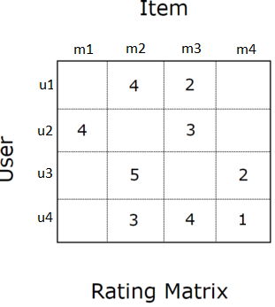

## Submission Info

Names:

- Gabriel Angelo Sandoval (NETID: grs4)
- Purohit Praveen (NETID: purohit4)

Contributions:

- Both team members worked on different parts of the code and concluded it together.

# System I: Content-Based Filtering

---

## Demo and Code

* `Demo` [[Shinyapp_link](https://grs4.shinyapps.io/content_based_filtering)]
* `System Code` [[Github_link](https://github.com/GabrielSandoval/cs598-project-4/tree/master/content_based_filtering)]
* `HTML Markdown File (Rmd)` [[Github_link](https://github.com/GabrielSandoval/cs598-project-4/tree/master/docs/System-I-II.Rmd)]

```{r setup, include=TRUE}
knitr::opts_chunk$set(warning = FALSE, message = FALSE, echo=TRUE)
```

```{r include=TRUE}
library(dplyr)
library(ggplot2)
library(recommenderlab)
library(DT)
library(data.table)
library(reshape2)
library(stringr)
```

## Download Data

Download the MovieLens 1M Dataset. There are four files: 

 * `README` [[Github_link](https://liangfgithub.github.io/MovieData/README?raw=true)]
 * `movies.dat` [[Github_link](https://liangfgithub.github.io/MovieData/movies.dat?raw=true)]
 * `ratings.dat` [[Github_link](https://liangfgithub.github.io/MovieData/ratings.dat?raw=true)]
 * `users.dat` [[Github_link](https://liangfgithub.github.io/MovieData/users.dat?raw=true)]
 
```{r include=TRUE}
 myurl = "https://liangfgithub.github.io/MovieData/"
```

## Read/Preprocess the Data

### Ratings data

  Ratings data consists of 4 columns: UserID, MovieID, Rating, Timestamp
```{r message=FALSE, warning=FALSE, echo=TRUE}
# use colClasses = 'NULL' to skip columns
ratings = read.csv(paste0(myurl, 'ratings.dat?raw=true'), 
                   sep = ':',
                   colClasses = c('integer', 'NULL'), 
                   header = FALSE)
colnames(ratings) = c('UserID', 'MovieID', 'Rating', 'Timestamp')
```
  Below is how the Ratings data look like:
```{r, result='asis', echo=TRUE}
datatable(head(ratings, 6), 
          class = "nowrap hover row-border", 
          options = list(dom = 't',
                         scrollX = FALSE, 
                         autoWidth = TRUE))
```
  This data can be interpreted as:

  For the first row, User 1 rated Movie 1193 with 5 at timestamp 978300760.
  
### Movies data
```{r include=TRUE}
movies = readLines(paste0(myurl, 'movies.dat?raw=true'))
movies = strsplit(movies, split = "::", fixed = TRUE, useBytes = TRUE)
movies = matrix(unlist(movies), ncol = 3, byrow = TRUE)
movies = data.frame(movies, stringsAsFactors = FALSE)
colnames(movies) = c('MovieID', 'Title', 'Genres')
movies$MovieID = as.integer(movies$MovieID)
```
  Some movie titles are accented. On these cases, we convert the encoding to UTF-8.

  Below is an example:
```{r message=FALSE, warning=FALSE, echo=TRUE}
# convert accented characters
movies$Title[73]
```

```{r message=FALSE, warning=FALSE, echo=TRUE}
movies$Title = iconv(movies$Title, "latin1", "UTF-8")
movies$Title[73]
```

  After that, we extracted the year of release of the movie from the title.
```{r include=TRUE}
# extract year
movies$Year = as.numeric(unlist(
  lapply(movies$Title, function(x) substr(x, nchar(x)-4, nchar(x)-1))))
```

  Below is how the Movies data look like:
```{r, result='asis', echo=TRUE}
datatable(head(movies, 6), 
          class = "nowrap hover row-border", 
          options = list(dom = 't',
                         scrollX = FALSE, 
                         autoWidth = TRUE))
```

  This data can be interpreted as:

  For the first row, Movie 1 which was released on 1995 has the Title "Toy Story (1995)" tagged with Genres Animation, Children's and Comedy.

## Making Recommendations (Content-Based filtering)

  There are three simple ways on how we can give recommendations to a user given we know the genre he/she is interested in.

### Method 1:

  For a user-given genre, the simplest way we can make recommendations is by getting all the movies tagged with that genre and calculating the average rating per movie. The movie with the highest average rating is placed higher in the list while the movie with the lesser average rating is placed lower in the list. Below is the popularity metric:

  $Popularity_m = \frac{\sum_{n=1}^{N}[R_n]}{N}$

  Where:

  * $Popularity_m$ is the Popularity metric for movie $m$
  * $N$ is the number of users
  * $n$ is the user
  * $R_n$ is Movie rating of user n

#### Sample Result:

```{r, result='asis', message=FALSE, warning=FALSE, echo=TRUE}
small_image_url = "https://liangfgithub.github.io/MovieImages/"
ratings %>% 
  group_by(MovieID) %>% 
  summarize(ratings_per_movie = n(), 
            ave_ratings = round(mean(Rating), dig=3)) %>%
  inner_join(movies, by = 'MovieID') %>%
  filter(str_detect(Genres, "Comedy")) %>%
  top_n(10, ave_ratings) %>%
  mutate(Image = paste0('</img>')) %>%
  select('Image', 'Title', 'ave_ratings') %>%
  arrange(desc(ave_ratings)) %>%
  datatable(class = "nowrap hover row-border", 
            escape = FALSE, 
            options = list(dom = 't',
                          scrollX = TRUE, autoWidth = TRUE))
```
  This however introduces a bias toward movies with few ratings. For the example above, the average rating of the movie "Follow the Bitch" is 5 but if we look at the dataset, we observe that the movie was only rated by one person.

  Similar to the case of the second most-'popular' movie on this recommendation list, "Smashing Time" received a perfect average rating but only 2 users rated that movie.

  In order to solve this issue, we can filter out movies that have less than $N$ (threshold) number of ratings. It is also important to consider that this $N$ threshold does not apply for all genres since not all genres have the same number of user ratings.

  With that in context, we explore the data further to know the distribution of ratings per genre pick a threshold based on that.

### Method 2:

#### Distribution of Ratings per Genre

  First create a binary indicator for the 18 genres a movie.  
```{r, result='asis', message=FALSE, warning=FALSE, echo=TRUE}
genres = as.data.frame(movies$Genres, stringsAsFactors=FALSE)
tmp = as.data.frame(tstrsplit(genres[,1], '[|]',
                              type.convert=TRUE),
                    stringsAsFactors=FALSE)
genre_list = c("Action", "Adventure", "Animation", 
               "Children's", "Comedy", "Crime",
               "Documentary", "Drama", "Fantasy",
               "Film-Noir", "Horror", "Musical", 
               "Mystery", "Romance", "Sci-Fi", 
               "Thriller", "War", "Western")
m = length(genre_list)
genre_matrix = matrix(0, nrow(movies), length(genre_list))
for(i in 1:nrow(tmp)){
  genre_matrix[i,genre_list %in% tmp[i,]]=1
}
colnames(genre_matrix) = genre_list
remove("tmp", "genres")
```

  For example, the genres for the movie "Toy Story (1995)" can be expressed as:

```{r, result='asis', message=FALSE, warning=FALSE, echo=TRUE}
genre_matrix[1, ]
```

  We do this for all movies. After that, we create a histogram showing the number of ratings for the 18 genres.

```{r, result='asis', message=FALSE, warning=FALSE, echo=TRUE}
tmp = ratings %>% 
  left_join(data.frame(MovieID = movies$MovieID, genre_matrix), 
            by = "MovieID") %>%
  select(-c("UserID", "MovieID", "Rating", "Timestamp"))
data.frame(Genres = genre_list, 
                 Popularity = as.vector(colSums(tmp))) %>% 
  ggplot(aes(reorder(Genres, Popularity), Popularity, fill = Popularity)) + 
  geom_bar(stat = "identity") + 
  geom_text(aes(label = round(Popularity, dig=3)), 
            position = position_stack(vjust = 0.5), 
            color="white", size=3) + 
  coord_flip() + 
  labs(y = 'Number of Ratings', x = 'Genre')
```
### Threshold per Genre

  Now that we know the distribution, we can pick a number relative the genre's number of rating. By doing empirical tests, we found that the following threshold per genre give good results:

  * $N = 1000$ for Comedy, Drama, Action, Thriller, Sci-Fi, Romance, Adventure
  * $N = 50$ for Crime, Horror, Children's, War
  * $N = 200$ for Animation, Musical, Mystery, Fantasy, Western, Film-Noir, Documentary

  Following threshold above for Comedy ($N=1000$) we get the following recommendations.

#### Sample Result:
```{r, result='asis', message=FALSE, warning=FALSE, echo=TRUE}
small_image_url = "https://liangfgithub.github.io/MovieImages/"
ratings %>% 
  group_by(MovieID) %>% 
  summarize(ratings_per_movie = n(), 
            ave_ratings = round(mean(Rating), dig=3)) %>%
  inner_join(movies, by = 'MovieID') %>%
  filter(str_detect(Genres, "Comedy")) %>%
  filter(ratings_per_movie > 1000) %>%
  top_n(10, ave_ratings) %>%
  mutate(Image = paste0('</img>')) %>%
  select('Image', 'Title', 'ave_ratings') %>%
  arrange(desc(ave_ratings)) %>%
  datatable(class = "nowrap hover row-border", 
            escape = FALSE, 
            options = list(dom = 't',
                          scrollX = TRUE, autoWidth = TRUE))
```

### Method 3:

  Since some users prefer more recent movies as recommendation, another datapoint we can consider is the release date of the movie. In addition to the average rating of the users per movie, we can add a recency function to boost our 'popular' metric. Below shows the simplest linear function we can use for boosting:

```{r, result='asis', message=FALSE, warning=FALSE, echo=TRUE}
recency_function = function(year) {
  minYear = min(movies$Year)
  maxYear = max(movies$Year)

  return(1 + (year - minYear) / (maxYear - minYear))
}

plot(recency_function(1919:2000), type='l', col='red', ylab='Boost', xlab='Movie Release (Year)', xaxt="n")
title("Receny Boost function")
axis(1, at = seq(0, 90, by = 10), labels=c(1919, 1930, 1940, 1950, 1960, 1970, 1980, 1990, 2000,2010))
```
  
  $f(year) = 1 + \frac{year - 1919}{2000 - 1919}$

  Where: 
  * $year$ is the year the movie was released

  The above graph shows the more recent the movie is, the greater the boost we'll introduce to the 'popular' metric.

  Our new 'popular' metric will now be:

  $Popularity_m = \frac{\sum_{n=1}^{N}[R_n]}{N}f(year_m)$

  Where:
  * $N$ is the number of users
  * $n$ is the user
  * $R_n$ is Movie rating of user $n$
  * $year_m$ is the year movie $m$ was released
  * $f(year_m)$ is the recency boost function

#### Sample Result:
```{r, result='asis', message=FALSE, warning=FALSE, echo=TRUE}
small_image_url = "https://liangfgithub.github.io/MovieImages/"
ratings %>% 
  group_by(MovieID) %>% 
  summarize(ratings_per_movie = n(), 
            Score = round(mean(Rating), dig=3)) %>%
  inner_join(movies, by = 'MovieID') %>%
  filter(str_detect(Genres, "Comedy")) %>%
  filter(ratings_per_movie > 1000) %>%
  top_n(10, Score) %>%
  mutate(Image = paste0('</img>')) %>%
  mutate(Score = round(Score * recency_function(Year), dig=3)) %>%
  select('Image', 'Title', 'Score') %>%
  arrange(desc(Score)) %>%
  datatable(class = "nowrap hover row-border", 
            escape = FALSE, 
            options = list(dom = 't',
                          scrollX = TRUE, autoWidth = TRUE))

```

  Compared to the results in Method 2, we can observe that the more recent movies are higher up the list.

  Depending on the data, we can change the boost function.


# System II: Collaborative Filtering

---

## Demo and Code

* `Demo - IBCF` [[Shinyapp_link](https://grs4.shinyapps.io/collaborative_filtering)]
* `Code` [[Github_link](https://github.com/GabrielSandoval/cs598-project-4/tree/master/collaborative_filtering)]
* `HTML Markdown File (Rmd)` [[Github_link](https://github.com/GabrielSandoval/cs598-project-4/tree/master/collaborative_filtering/docs/System-II.Rmd)]

```{r, message=FALSE}
library(recommenderlab)
library(Matrix)
library(ggplot2)
library(foreach)
library(doParallel)
library(DT)
library(data.table)
registerDoParallel(cores=5)
```


## Download Data

Download the MovieLens 1M Dataset. There are four files: 

 * `README` [[Github_link](https://liangfgithub.github.io/MovieData/README?raw=true)]
 * `movies.dat` [[Github_link](https://liangfgithub.github.io/MovieData/movies.dat?raw=true)]
 * `ratings.dat` [[Github_link](https://liangfgithub.github.io/MovieData/ratings.dat?raw=true)]
 * `users.dat` [[Github_link](https://liangfgithub.github.io/MovieData/users.dat?raw=true)]
 
```{r include=TRUE}
 myurl = "https://liangfgithub.github.io/MovieData/"
```

## Read the Data (ratings.dat)

  Ratings data consists of 4 columns: UserID, MovieID, Rating, Timestamp

```{r message=FALSE, warning=FALSE, echo=TRUE}
myurl = "https://liangfgithub.github.io/MovieData/"

ratings = read.csv(paste0(myurl, 'ratings.dat?raw=true'), 
                   sep = ':',
                   colClasses = c('integer', 'NULL'), 
                   header = FALSE)
colnames(ratings) = c('UserID', 'MovieID', 'Rating', 'Timestamp')
ratings$Timestamp = NULL
```

  Below is how the Ratings data look like:
```{r, result='asis', echo=TRUE}
datatable(head(ratings, 6), 
          class = "nowrap hover row-border", 
          options = list(dom = 't',
                         scrollX = FALSE, 
                         autoWidth = TRUE))
```
  This data can be interpreted as:

  For the first row, User 1 rated Movie 1193 with 5 at timestamp 978300760.


## Training Test Split

  Create

  * **train** data that contain about 80\% rows of `ratings.dat` 

  * **test** data that contain about 20\% of rows of `ratings.dat`


## Preprocessing

  * For each model, we create a sparse $R$ matrix where each element $R_{ij}$ is the rating of user $i$ for movie $j$.

  


  The above can be read as:

* User $u1$ rated Movie $m2$ with $4$.

```{r echo=TRUE, message=FALSE, warning=FALSE}
  createRatingMatrix = function(train){
    # First create a utility matrix stored as a sparse matrix.
    i = paste0('u', train$UserID)
    j = paste0('m', train$MovieID)
    x = train$Rating
    
    tmp = data.frame(i, j, x, stringsAsFactors = T)
    Rmat = sparseMatrix(as.integer(tmp$i), as.integer(tmp$j), x = tmp$x)
    
    rownames(Rmat) = levels(tmp$i)
    colnames(Rmat) = levels(tmp$j)
    Rmat = new('realRatingMatrix', data = Rmat)
    
    return(Rmat)
  }
```

```{r message=FALSE, warning=FALSE, echo=TRUE}
  train.id = sample(nrow(ratings), floor(nrow(ratings)) * 0.8)
  train = ratings[train.id, ]
  test = ratings[-train.id, ]
  
  Rmat = createRatingMatrix(train)
```

## Model Evaluation: UBCF & IBCF

  For this study, we'll be comparing two recommendation algorithm. For simpilicity, we're using the `recommenderlab` package in R and evaluate the two methods:

### User-Based Collaborative Filtering (UBCF)

#### User-Based Collaborative Filtering is a memory-based approach which tries to cater the following case:

  "Users similar to you also liked..."

  Parameters to this model include the following:
  
  * $nn$ - determines how many users will be aggregated (nearest neighbors) to make a prediction. For our evaluation, we will use $nn=25$.
  * similarity measure - determines the distance metric between the users. For our evaluation, we will use the Cosine similarity measure.
  * normalize - determines the normalization method used to remove individual rating bias. For our evaluation, we will use the Z-score formula.
  
#### Goal

  Here, we try to predict the probability that User x likes a movie by referencing to $k$-other users that rated the similar movies as User x.
  
#### Algorithm

  The first step is to do normalization. This is an important step because some users are more generous when rating movies - they generally give more high ratings. For example, if they like a movie, the give a rating of 5 but if they don't they give a rating of 4. Other users, on the other hand, are more critical when it comes to rating movies. They give a rating of 5 if they liked the movie and 1 if they don't like it. Normalizing allows us to be able to compare both users on common grounds. One way we can do normalize is by using the z-score formula:
  
  $h(r_{ui}) = \frac{r_{ui} - \hat{r_u}}{\sigma_{r_{u}}}$
  
  
  Where:
  * $h(r_{ui})$ - is the normalized user rating for item $i$
  * $\frac{r_{ui}$ - is the user rating for item $i$
  * $\hat{r_u}$ - is the average of all the ratings the user made
  * \sigma_{r_{u}} - is the standard deviation of the ratings the user made
  
  After normalizing, the similarity values between User x and other users are measured by observing all the items that are rated by both of them. One of the common ways to compute this distance metric is by using cosine similarity expressed as:
  
  $sim_{Cosine}(\vec{x}, \vec{y}) = \frac{\vec{x}\cdot\vec{y}}{\left \| \vec{x} \right \|\left \| \vec{y} \right \|}$
  
  Where:
  
  * $\vec{x}$ represents the row vector of $users_x$ in the $R$ matrix
  * $\vec{y}$ represents the row vector of $users_y$ in the $R$ matrix
  
  Take note that the dimension (items) used is only for the items rated by both users x and y.
  
  After getting the $k$-most similar users ($k$-nearest neighbors), we aggregate their ratings to form the prediction. The simplest way to do this is by averaging the ratings in the neighborhood.
  
  $\hat{r}_{aj} = \frac{1}{\left | N(a) \right |}\sum_{i\in N(a)} r_{ij}$
  
  Where:
  * $\hat{r_{aj}}$ - is the predicted rating of the active user $a$ for item $j$
  * $\left | N(a) \right |$ - is the number of nearest neighbor for active user $a$
  * $r_{ij}$ - is the rating of nearest neighbor user $i$ for item $j$
  
### Item-Based Collaborative Filtering (IBCF)

#### Item-Based Collaborative Filtering is a memory-based approach which tries to cater the following case:

  "Users who liked these item also liked..."
  
  Parameters to this model include the following:
  
  * $k$ - determines how many users will be aggregated ($k$ nearest neighbors) to make a prediction. For our evaluation, we will use $k=25$.
  * similarity measure - determines the distance metric between the users. For our evaluation, we will use the Cosine similarity measure.
  * normalize - determines the normalization method used to remove individual rating bias. For our evaluation, we will use the Z-score formula.
  
#### Goal

  Here, we try to predict the probability that user X likes a movie by referencing to other items who have rated the same set of items as user X.

#### Algorithm

  With the same reason as mentioned in the User-Based Collaborative Filtering, normalization is an important step to reduce individual rating bias. The same Z-score formula is used.
  
  $h(r_{ui}) = \frac{r_{ui} - \hat{r_u}}{\sigma_{r_{u}}}$
  
  Where:
  * $h(r_{ui})$ - is the normalized user rating for item $i$
  * $\frac{r_{ui}$ - is the user rating for item $i$
  * $\hat{r_u}$ - is the average of all the ratings the user made
  * \sigma_{r_{u}} - is the standard deviation of the ratings the user made

  After normalizing, item-to-item similarities using a similarity measure is generated which we'll call $S$. One of the common ways to compute this distance metric is again, by using Cosine similarity.
    
  Space and time complexity is reduced to $n x k$ with $n < k$ ($k$ nearest neighbor). This similarity subset is expressed as $S(i)$.
  
  Recommendation of item $i$ for active user $a$ is made by using the similarities to calculate a weighted sum of the user's ratings for related items:
  
  $\hat{r}_{ai} = \frac{1}{\sum_{j\in{S(i)\cap{l;r_{al}\neq?}}}s_{ij}} \sum_{{j\in{S(i)\cap{l;r_{al}\neq?}}}}s_{ij}$
  
  Where:
  * $\hat{r_{aj}}$ - is the predicted rating of the active user $a$ for item $j$
  * $s_{ij}$ - is the weight obtained from the ${i}^{th}$ row and $j^{th}$ column of the similarity matrix $S$ that we computed.
  * ${r_{aj}}$ - is the rating of active user $a$ for item $j$.
  
  
### Handling missing values:

  On test evaluation, missing values are handled by setting it as the average rating among all the items the user rated. For cases where this is not applicable, we set it to $2.5$.

## Results

```{r message=FALSE, warning=FALSE, echo=TRUE}
output = foreach(iter = 1:10) %dopar% {
  print(paste0("Iteration: ", iter))
  
  library(recommenderlab)
  library(Matrix)
  
  createRatingMatrix = function(train){
    # First create a utility matrix stored as a sparse matrix.
    i = paste0('u', train$UserID)
    j = paste0('m', train$MovieID)
    x = train$Rating
    
    tmp = data.frame(i, j, x, stringsAsFactors = T)
    Rmat = sparseMatrix(as.integer(tmp$i), as.integer(tmp$j), x = tmp$x)
    
    rownames(Rmat) = levels(tmp$i)
    colnames(Rmat) = levels(tmp$j)
    Rmat = new('realRatingMatrix', data = Rmat)
    Rmat = normalize(Rmat)
    
    return(Rmat)
  }
  
  trainMethod = function(Rmat, rec, method = ""){
    out = c()
    
    start_time = Sys.time()
    out$recom = predict(rec, Rmat, type = 'ratings')  
    end_time = Sys.time()
    out$training_time = end_time - start_time
    
    return(out)
  }
  
  testMethod = function(recom, Rmat, test){
    rec_list = as(recom, 'list')  # each element are ratings of that user
    
    test.pred = test
    test.pred$rating = NA
    
    # For all lines in test file, one by one
    for (u in 1:nrow(test)){
      # Read userid and movieid from columns 2 and 3 of test data
      userid = as.character(paste0('u', test$UserID[u]))
      movieid = as.character(paste0('m', test$MovieID[u]))
      
      rating = rec_list[[userid]][movieid]
      
      # handle missing values; Use the mean rating of this user.
      user_ratings = Rmat[test$UserID[u]]
      user_ratings = user_ratings[!is.na(user_ratings)]
      mean_user_rating = mean(user_ratings)
      fallback = ifelse(is.na(mean_user_rating), 2.5, mean_user_rating)
      test.pred$rating[u] = ifelse(is.na(rating), fallback, rating)
    }
    
    rmse = sqrt(mean((test$Rating - test.pred$rating)^2))
    return(rmse)
  }
  
  # Train-test split
  train.id = sample(nrow(ratings), floor(nrow(ratings)) * 0.8)
  train = ratings[train.id, ]
  test = ratings[-train.id, ]
  
  Rmat = createRatingMatrix(train)
  
  # ===========================================================
  method = "UBCF" # ===========================================
  # ===========================================================
  
  rec_UBCF = Recommender(Rmat, method = method,
                  parameter = list(normalize = 'Z-score', 
                                   method = 'Cosine', 
                                   nn = 25))
  out_ubcf        = trainMethod(Rmat, rec_UBCF, method = method)
  out_ubcf$rmse   = testMethod(out_ubcf$recom, Rmat, test)
  out_ubcf$iter   = iter
  out_ubcf$method = method
  
  # ===========================================================
  method = "IBCF" # ===========================================
  # ===========================================================
  
  rec_IBCF = Recommender(Rmat, method = method,
                  parameter = list(normalize = 'Z-score', 
                                   method = 'Cosine',
                                   k = 25))
  
  out_ibcf        = trainMethod(Rmat, rec_IBCF, method = method)
  out_ibcf$rmse   = testMethod(out_ibcf$recom, Rmat,test)
  out_ibcf$iter   = iter
  out_ibcf$method = method
  # ===========================================================
  
  
  c(out_ubcf, out_ibcf)
}

saveRDS(output, file = "output.rds")
```

### Accuracy

  For accuracy, we use the popular Root Mean Square Error (RMSE).
  
  $RMSE = \sqrt{ \frac{\sum_{(i,j)\in K}(r_{ij} - \hat{r}_{ij})^{2}}{\left | K \right |}}$

```{r message=FALSE, warning=FALSE, echo=TRUE}
IBCF_errors = c()
UBCF_errors = c()
IBCF_times = c()
UBCF_times = c()

for(iter in 1:10) {
  ubcf = output[[iter]][1:6]
  ibcf = output[[iter]][7:12]
  IBCF_errors[iter] = ibcf$rmse
  UBCF_errors[iter] = ubcf$rmse
  IBCF_times[iter] = as(ibcf$training_time, 'double')
  UBCF_times[iter] = as(ubcf$training_time, 'double')
}
```

```{r message=FALSE, warning=FALSE, echo=TRUE}
plot(1:10, UBCF_errors, type="b", col="blue", lwd=1, pch=15, xlab="Iteration", ylab="RMSE", ylim=range(1.4,1.6))
lines(1:10, IBCF_errors, type="b", col="red", lwd=1, pch=19)
title("Model Performance")

legend(4.5,1.53, c("IBCF","UBCF"), lwd=c(1,1), col=c("red","blue"), pch=c(15,19), y.intersp=1.5)
```

  The above graph shows that for all 10 iterations, the User-Based collaborative Filtering performs better than the Item-Based Collaborative Filtering.
  
### Efficiency

```{r message=FALSE, warning=FALSE, echo=TRUE}
plot(1:10, UBCF_times, type="b", col="blue", lwd=1, pch=15, xlab="Iteration", ylab="Minutes", ylim=range(0, 20))
lines(1:10, IBCF_times, type="b", col="red", lwd=1, pch=19)
title("Model Evaluation Time")

legend(4.5,13, c("UBCF ","IBCF"), lwd=c(1,1), col=c("blue","red"), pch=c(15,19), y.intersp=1.5)
```

  Although Item-Based Collborative Filtering is slightly inferior in terms of accuracy, it is the better choice if we're aiming for efficiency. Since in Item-Based Collaborative Filtering, we reduce the similarity matrix ($N$ x $K$) as opposed to a full $N$ x $N$.

## Machine Specification

* CPU: Ryzen 5 3600 6-Core Processor 3.60GHz
* RAM: 32.0 GB
* Storage: 1TB SSD
* OS: Windows 10 Pro

* NOTE: Tests were ran in parallel by utilizing 5 CPU cores.

## Sources

* recommenderlab: A Framework for Developing and Testing Recommendation Algorithms
  
  https://cran.r-project.org/web/packages/recommenderlab/vignettes/recommenderlab.pdf